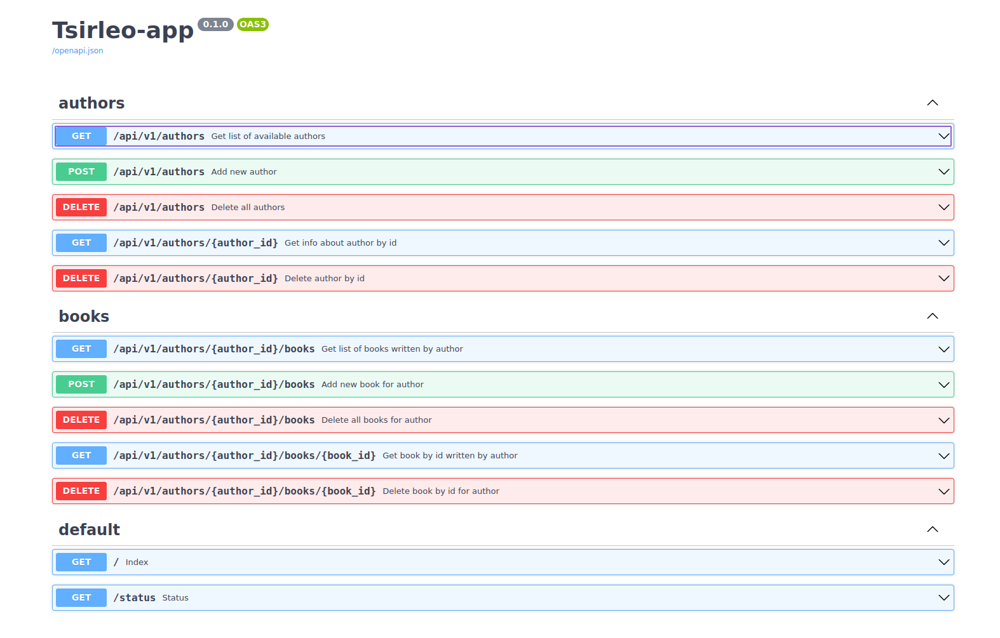

# Практическая работа №1 “Основы контейнерной виртуализации”

## Команды

Все команды выполняются в директории **HW_1**.
* **Сборка**
    ```shell
    docker compose build
    ```

* **Запуск в detach режиме**
    ```shell
    docker compose up -d
    ```
  Для запуска в обычном режиме не указывайте `-d` флаг.

* **Остановка контейнеров**
    ```shell
    docker compose stop
    ```

* **Удаление контейнеров**
    ```shell
    docker compose down
    ```

* **Удаление docker-volume базы данных**
    ```shell
    docker volume rm hw_1_database_volume
    ```

* **Посмотреть логи контейнеров**
    ```shell
    $ docker compose logs mysql-db
    $ docker compose logs server-app
    ```

## API сервиса
После запуска сервиса, документацию можно получить по ссылкам:
* FastAPI Swagger UI - http://localhost:12345/docs 
* ReDoc - http://localhost:12345/redoc
* OpenAPI file - http://localhost:12345/openapi.json 

По первой ссылке доступен интерфейс, в котором можно попробовать запросы в удобном виде без необходимости 
посылать *curl* запросы из консоли, или скачивания ***Insomnia***.



## Примеры curl запросов (типовые сценарии)

### Authors

1. Get list of available authors: **GET /api/v1/authors**
    ```shell
    curl -X 'GET' \
      'http://localhost:12345/api/v1/authors' \
      -H 'accept: application/json'
    ```
2. Add new author: **POST /api/v1/authors**
    ```shell
    curl -X 'POST' \
      'http://localhost:12345/api/v1/authors' \
      -H 'accept: application/json' \
      -H 'Content-Type: application/json' \
      -d '{"firstname": "Ivan", "lastname": "Ivanov", "birthplace": "Tula", "birthdate": "2010-03-19"}'
    ```
3. Delete all authors: **DELETE /api/v1/authors**
    ```shell
    curl -X 'DELETE' \
      'http://localhost:12345/api/v1/authors' \
      -H 'accept: */*'
    ```
4. Get info about author by id: **GET /api/v1/authors/{author_id}**
    ```shell
    curl -X 'GET' \
      'http://localhost:12345/api/v1/authors/e36cdd83-7f3c-4eff-824e-62659854df7e' \
      -H 'accept: application/json'
    ```
5. Delete author by id: **DELETE /api/v1/authors/{author_id}**
    ```shell
    curl -X 'DELETE' \
      'http://localhost:12345/api/v1/authors/e36cdd83-7f3c-4eff-824e-62659854df7e' \
      -H 'accept: */*'
    ```

При удалении автора из базы данных, книги связанные с ним каскадно удаляются из БД.

### Books

1. Get list of books written by author: **GET /api/v1/authors/{author_id}/books**
    ```shell
    curl -X 'GET' \
      'http://localhost:12345/api/v1/authors/dbf5861a-495b-4f7c-8878-1e2ef702d6ea/books' \
      -H 'accept: application/json'
    ```
2. Add new book for author: **POST /api/v1/authors/{author_id}/books**
    ```shell
    curl -X 'POST' \
      'http://localhost:12345/api/v1/authors/dbf5861a-495b-4f7c-8878-1e2ef702d6ea/books' \
      -H 'accept: application/json' \
      -H 'Content-Type: application/json' \
      -d '{"title": "Fairytale", "publishing_house": "Zvezda", "publication_date": "2001-03-19"}'
    ```
3. Delete all books for author: **DELETE /api/v1/authors/{author_id}/books**
    ```shell
    curl -X 'DELETE' \
      'http://localhost:12345/api/v1/authors/dbf5861a-495b-4f7c-8878-1e2ef702d6ea/books' \
      -H 'accept: */*'
    ```
4. Get book by id written by author: **GET /api/v1/authors/{author_id}/books/{book_id}**
    ```shell
    curl -X 'GET' \
      'http://localhost:12345/api/v1/authors/dbf5861a-495b-4f7c-8878-1e2ef702d6ea/books/aa7ca562-40b4-4fb7-b2ea-dfbcd6375567' \
      -H 'accept: application/json'
    ```
5. Delete book by id for author: **DELETE /api/v1/authors/{author_id}/books/{book_id}**
    ```shell
    curl -X 'DELETE' \
      'http://localhost:12345/api/v1/authors/dbf5861a-495b-4f7c-8878-1e2ef702d6ea/books/aa7ca562-40b4-4fb7-b2ea-dfbcd6375567' \
      -H 'accept: */*'
    ```
