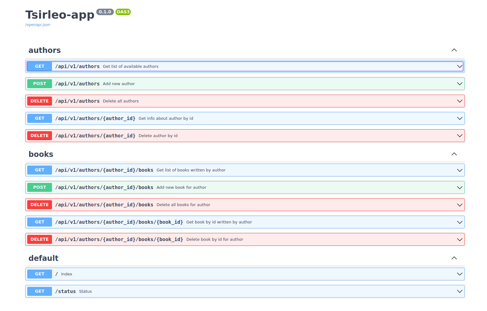

# Практическая работа №2 “Использование Kubernetes”

## Команды

Все команды выполняются в директории **HW_2**. Для упрощения используется makefile с различными целями. Целевая платформа **Linux**, в случае использования MacOS или Windows некоторые из команд могут не сработать, в таком случае смотрите в документацию [Minikube](https://minikube.sigs.k8s.io/docs/start/) и [kubectl](https://kubernetes.io/ru/docs/tasks/tools/install-kubectl/).

**Работа с инструментом minikube**:
* уcтановка minikube
    ```shell
    make minikube/install
    ```
* удаление minikube
    ```shell
    make minikube/uninstall
    ```
* запуск кластера minikube
    ```shell
    make minikube/start
    ```
* остановка кластера minikube
    ```shell
    make minikube/stop
    ```
* удаление кластера minikube
    ```shell
    make minikube/delete
    ```
* запустить дэшборд minikube
    ```shell
    make minikube/dashboard
    ```
**Работа с инструментом kubectl**:
* уcтановка kubectl
    ```shell
    make kubectl/install:
    ```
* удаление kubectl
    ```shell
    make kubectl/uninstall
    ```
  
**Получение информации о ресурсах кластера**
* информация о кластере
    ```shell
    make cluster_info
    ```
* информация о подах
    ```shell
    make pods_info
    ```
* информация о сервисах
    ```shell
    make svc_info
    ```

**Работа с приложением**:
* полный деплой сервиса с созданием экземпляров сущностей kubernetes
    ```shell
    make app/deploy/all
    ```

* запуск deployments отдельно от создания экземпляров сущностей
    ```shell
    make app/deploy/deployment
    ```

* получить ссылку на веб-интерфейс приложения
    ```shell
    make get_link
    ```
    При использовании MacOS данная команда может работать некорректно, поскольку необходимо включать туннелирование. Подробнее можно прочитать [тут](https://minikube.sigs.k8s.io/docs/handbook/accessing/).
    > The network is limited if using the Docker driver on Darwin, Windows, or WSL, and the Node IP is not reachable directly. \
      Running minikube on Linux with the Docker driver will result in no tunnel being created.

* полное удаление созданных экземпляров
    ```shell
    make app/remove/all
    ```

* удаление deployments и связанных с ними подов
    ```shell
    make app/remove/deployment
    ```
* в случае если не установлены инструменты minikube и kubectl можно выполнить следующую команду, 
которая произведет их установку, запустит кластер и деплой приложения:
    ```shell
    make all
    ```

**Некоторые дополнительные команды**:
* посмотреть подробную информацию о поде
    ```shell
    kubectl describe pod -n default <podname>
    ```
* **Посмотреть логи контейнера внутри пода**
    ```shell
    kubectl logs -n default <podname>
    ```

## API сервиса
После запуска сервиса, документацию можно получить по ссылкам (вместо 192.168.49.2 подставьте свой адрес кластера):
* FastAPI Swagger UI - http://192.168.49.2:30012/docs 
* ReDoc - http://192.168.49.2:30012/redoc
* OpenAPI file - http://192.168.49.2:30012/openapi.json 

По первой ссылке доступен интерфейс, в котором можно попробовать запросы в удобном виде без необходимости 
посылать *curl* запросы из консоли, или скачивания ***Insomnia***.



## Примеры curl запросов (типовые сценарии)

### Authors

1. Get list of available authors: **GET /api/v1/authors**
    ```shell
    curl -X 'GET' \
      'http://192.168.49.2:30012/api/v1/authors' \
      -H 'accept: application/json'
    ```
2. Add new author: **POST /api/v1/authors**
    ```shell
    curl -X 'POST' \
      'http://192.168.49.2:30012/api/v1/authors' \
      -H 'accept: application/json' \
      -H 'Content-Type: application/json' \
      -d '{"firstname": "Ivan", "lastname": "Ivanov", "birthplace": "Tula", "birthdate": "2010-03-19"}'
    ```
3. Delete all authors: **DELETE /api/v1/authors**
    ```shell
    curl -X 'DELETE' \
      'http://192.168.49.2:30012/api/v1/authors' \
      -H 'accept: */*'
    ```
4. Get info about author by id: **GET /api/v1/authors/{author_id}**
    ```shell
    curl -X 'GET' \
      'http://192.168.49.2:30012/api/v1/authors/e36cdd83-7f3c-4eff-824e-62659854df7e' \
      -H 'accept: application/json'
    ```
5. Delete author by id: **DELETE /api/v1/authors/{author_id}**
    ```shell
    curl -X 'DELETE' \
      'http://192.168.49.2:30012/api/v1/authors/e36cdd83-7f3c-4eff-824e-62659854df7e' \
      -H 'accept: */*'
    ```

При удалении автора из базы данных, книги связанные с ним каскадно удаляются из БД.

### Books

1. Get list of books written by author: **GET /api/v1/authors/{author_id}/books**
    ```shell
    curl -X 'GET' \
      'http://192.168.49.2:30012/api/v1/authors/dbf5861a-495b-4f7c-8878-1e2ef702d6ea/books' \
      -H 'accept: application/json'
    ```
2. Add new book for author: **POST /api/v1/authors/{author_id}/books**
    ```shell
    curl -X 'POST' \
      'http://192.168.49.2:30012/api/v1/authors/dbf5861a-495b-4f7c-8878-1e2ef702d6ea/books' \
      -H 'accept: application/json' \
      -H 'Content-Type: application/json' \
      -d '{"title": "Fairytale", "publishing_house": "Zvezda", "publication_date": "2001-03-19"}'
    ```
3. Delete all books for author: **DELETE /api/v1/authors/{author_id}/books**
    ```shell
    curl -X 'DELETE' \
      'http://192.168.49.2:30012/api/v1/authors/dbf5861a-495b-4f7c-8878-1e2ef702d6ea/books' \
      -H 'accept: */*'
    ```
4. Get book by id written by author: **GET /api/v1/authors/{author_id}/books/{book_id}**
    ```shell
    curl -X 'GET' \
      'http://192.168.49.2:30012/api/v1/authors/dbf5861a-495b-4f7c-8878-1e2ef702d6ea/books/aa7ca562-40b4-4fb7-b2ea-dfbcd6375567' \
      -H 'accept: application/json'
    ```
5. Delete book by id for author: **DELETE /api/v1/authors/{author_id}/books/{book_id}**
    ```shell
    curl -X 'DELETE' \
      'http://192.168.49.2:30012/api/v1/authors/dbf5861a-495b-4f7c-8878-1e2ef702d6ea/books/aa7ca562-40b4-4fb7-b2ea-dfbcd6375567' \
      -H 'accept: */*'
    ```
